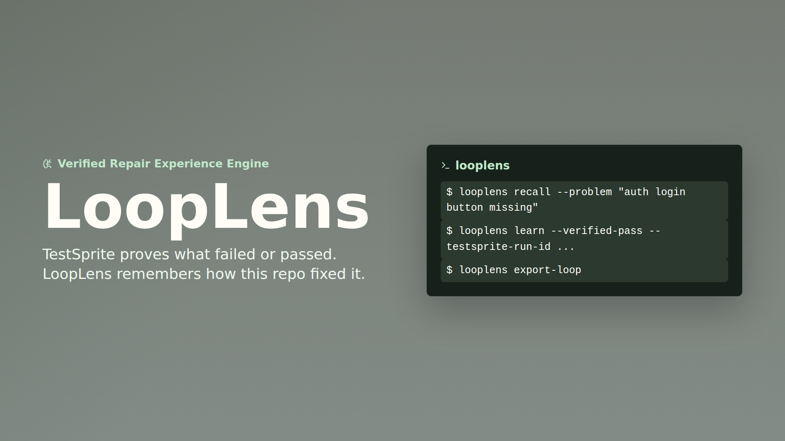

# LoopLens


**Verified Repair Experience Engine for AI Coding Agents.**

LoopLens is a local-first CLI that turns TestSprite-verified repairs into reusable, repository-specific repair experience. TestSprite tells the agent **what broke** and proves whether the fix passed. LoopLens preserves **the repair trajectory, decision, and evidence that got this repository back to PASS**.

```text
TestSprite failure bundle
        -> looplens recall
        -> agent repair
        -> TestSprite PASS
        -> looplens learn
        -> reusable LOOP.md memory
```

## Why LoopLens

AI coding agents are good at debugging, but most repair loops are stateless. A failure appears, the agent reasons from scratch, patches the code, and then forgets the path that worked.

LoopLens turns verified repairs into repair experience:

- **Decision history**: what the agent tried and what finally worked.
- **Verified knowledge only**: experiences are stored only after FAIL -> patch -> PASS.
- **Evidence-backed learning**: TestSprite run IDs, target URLs, Git commits, branches, agents, and changed files can travel with the lesson.
- **AI-friendly recall**: future failures get relevant lessons instead of the whole history.
- **Git-native storage**: YAML and Markdown files that can be reviewed, diffed, committed, and rolled back.

That makes LoopLens different from generic "memory": it does not save everything an agent saw. It saves the repair decisions that were proven correct.

## Hackathon Proof

- **Live demo**: https://demo-app-pink-omega.vercel.app
- **TestSprite status**: PASS
- **Run ID**: `7e9da0ed-e9a1-4cee-9a4d-92c272bd557e`
- **Latest rerun**: `9eb5fd97-b3f0-4da6-9f30-52deb51c5247`, 28/28 steps passed
- **Test ID**: `1d52848a-4f5a-46af-a83f-f7cb9e9c0b29`
- **TestSprite dashboard**: https://www.testsprite.com/dashboard/tests/82a9909d-e588-4719-a9ba-53b957d12eb1/test/1d52848a-4f5a-46af-a83f-f7cb9e9c0b29

The demo app is a public surface for verification. The actual product is the CLI in `packages/cli`, powered by the core engine in `packages/core`.

## Product Boundary

| TestSprite | LoopLens |
| --- | --- |
| Verification layer | Repair experience layer |
| Failure bundle | Decision history |
| Browser/API testing | Repository repair memory |
| Answers "what failed?" | Answers "how did we fix this before?" |
| Produces PASS/FAIL evidence | Stores verified repair lessons |

LoopLens does not replace TestSprite, and it is not a feature clone of TestSprite. TestSprite is the verification layer that creates evidence. LoopLens is the repair experience layer that converts that evidence into reusable agent knowledge for this repository.

## Install

```bash
cargo install --path packages/cli
```

Or run directly from the workspace:

```bash
cargo run -q -p looplens -- --help
```

## CLI Workflow

Initialize repository memory:

```bash
looplens init
```

Recall similar verified repairs from a TestSprite failure bundle:

```bash
looplens recall --failure-bundle .testsprite/failure-bundle.md
```

Try the included sample repository memory:

```bash
cargo run -q -p looplens -- recall --problem "auth login button missing"
```

Recall is explainable. Results include matched terms, hypothesis overlap, patch/file overlap, and a score breakdown across lexical, patch, hypothesis, confidence, and recency signals.

Store a new repair experience only after the final verification is PASS:

```bash
looplens learn \
  --verified-pass \
  --problem "Login flow failed" \
  --testsprite-hypothesis "Missing login button" \
  --failed-attempt "Changed selector" \
  --successful-decision "Fix auth state rendering" \
  --patch app/login/page.tsx \
  --lesson "Check auth-state rendering before modifying selectors." \
  --testsprite-run-id "7e9da0ed-e9a1-4cee-9a4d-92c272bd557e" \
  --test-id "1d52848a-4f5a-46af-a83f-f7cb9e9c0b29" \
  --target-url "https://demo-app-pink-omega.vercel.app" \
  --agent "code" \
  --file-changed "app/login/page.tsx" \
  --confidence 0.94
```

Export the repository memory for agents and reviewers:

```bash
looplens export-loop
```

## Repository Memory

This repository intentionally commits one sample verified repair in `.looplens/` as demo repository memory, so the recall workflow works immediately after cloning. It is not accidental generated state.

There are two loop artifacts in this submission: root `LOOP.md` is the hackathon-facing agent memory narrative, while `.looplens/LOOP.md` is the generated memory file that LoopLens would carry inside any repository using the CLI.

`looplens init` creates a local, repo-scoped memory store:

```text
.looplens/
  config.toml
  experiences/
    exp-001.yaml
  trajectories/
    exp-001.md
  LOOP.md
```

Experience files are intentionally boring: readable YAML, stable Markdown, no cloud account, no backend, no dashboard.

```yaml
id: EXP-001
verified_at: "2026-07-04T17:25:45Z"
problem: Login flow failed
testsprite_hypothesis: Missing login button
trajectory_summary:
  failed_attempts:
    - Added data-testid
    - Updated selector
  successful_decision: Fix auth state rendering
patches:
  - app/login/page.tsx
lesson: Check auth-state rendering before modifying selectors.
evidence:
  testsprite_run_id: 7e9da0ed-e9a1-4cee-9a4d-92c272bd557e
  test_id: 1d52848a-4f5a-46af-a83f-f7cb9e9c0b29
  target_url: https://demo-app-pink-omega.vercel.app
  commit_sha: 7545ad24c4684fb408122e770846a445edd8f8a8
  branch: main
  agent: code
  files_changed:
    - examples/demo-app/src/App.jsx
verified: PASS
confidence: 0.94
```

## Architecture

```text
packages/core      Repair Experience Engine
packages/cli       CLI adapter over the core engine
examples/demo-app  Public hackathon demo surface
.testsprite        TestSprite plan and run artifact
```

The core engine owns storage, retrieval, ranking, and LOOP export. The CLI is deliberately thin so the same engine can later power an MCP adapter.

The web demo is an interactive verification surface for judges and TestSprite. It is not the product UI; LoopLens is the CLI and repository memory engine.

## Demo App

Run the public demo locally:

```bash
cd examples/demo-app
npm install
npm run dev
```

Build it:

```bash
npm run build
```

## Demo Video

[](https://cdn.jsdelivr.net/gh/Lexiie/LoopLens@main/assets/looplens-demo.mp4)

**Watch:** [LoopLens demo video](https://cdn.jsdelivr.net/gh/Lexiie/LoopLens@main/assets/looplens-demo.mp4)

## Verification

Commands already run for this submission:

```bash
cargo fmt --all -- --check
cargo test --workspace
npm --prefix examples/demo-app run build
testsprite test create --plan-from .testsprite/looplens-demo.plan.json --run --wait
```

The TestSprite plan lives at `.testsprite/looplens-demo.plan.json`, and the captured run output lives at `.testsprite/looplens-demo-run.json`.
The latest rerun result lives at `.testsprite/looplens-demo-rerun-final-wait-2.json`.

## Roadmap

- v0: Verified Repair Memory.
- v1: Explainable Trajectory Learning.
- v2: MCP adapter for native agent access.
- v3: Cross-repository repair memory.
- v4: Organization repair knowledge base.
- v5: Multi-agent shared repair graph.

Near-term engineering work:

- MCP adapter for native agent access.
- Repair trajectory compaction for long-running repositories.
- Stronger local retrieval with embeddings.
- Cross-repository memory with provenance and confidence scoring.
